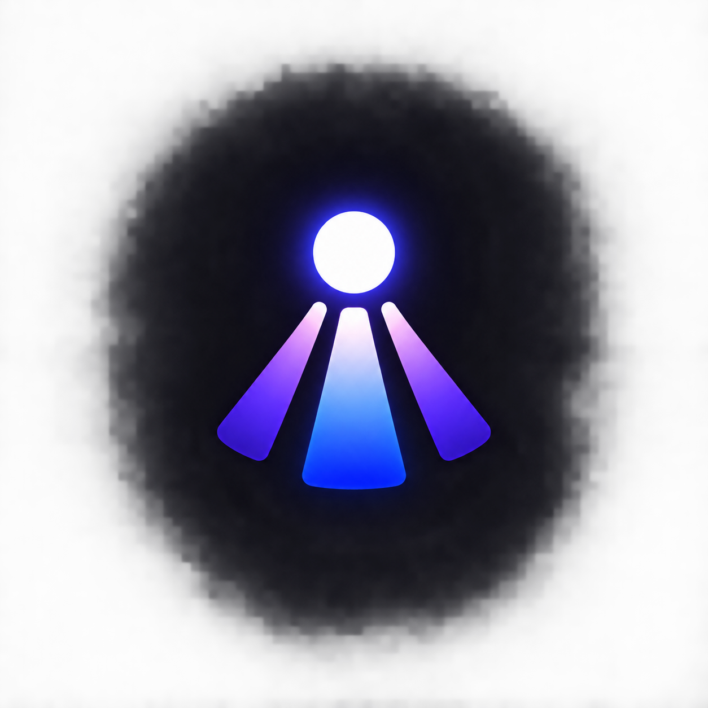

<div align="center">
  

  # Beacon

  **Minimalist macOS Goal Operating Layer — Glance, Update, Move On**  
  *Engineered & Maintained by [Tarunya K](https://github.com/TarunyaProgrammer)*

  [](https://www.apple.com/macos/)
  [](https://github.com/TarunyaProgrammer/Dynamic_Island/releases)
  [](https://www.typescriptlang.org)
  [](https://react.dev)
  [](https://www.electronjs.org)
  [](https://sqlite.org)
  [](https://github.com/TarunyaProgrammer/Dynamic_Island)
</div>

---

**Beacon** is a fast, minimalist macOS goal and progress operating layer built on **Electron, TypeScript, React 19, Vite, and SQLite**.

It eliminates the friction of traditional goal-tracking tools by embedding progress directly into your active workspace via the macOS menu bar, a Dynamic Island top overlay, and a global `⌘ + Shift + B` command palette.

---

## Key Highlights

### ⚡ Sub-2-Second Progress Updates
- One-click `+1` / `+step` quick increments from the menu bar popover, top notch pill, or keyboard palette.
- Instant feedback with undo/redo stack (`⌘Z` / `⌘⇧Z`) and automatic goal completion detection.

### 🏝️ Dynamic Island Top Notch Overlay & Ambient Media
- Frameless, translucent pill pinned to the top center of your screen.
- Auto-detects notch geometry, expands smoothly on hover to reveal focus goals, and auto-collapses on leave.
- Real-time media controls for Apple Music, Spotify, and Chrome embedded directly in the notch pill.

### 🧘 Ambient AI Spirit Companion & Focus Engine
- Contextual spirit companion that reacts to session productivity, milestones, and focus timers.
- Integrated Pomodoro and custom focus session timers synchronized across all five surfaces.

### 🎯 Multi-Surface Synchronization
- **Main Workspace**: Full goal dashboard, category filters, milestone breakdown, and live activity stream.
- **Menu Bar Quick Hub**: Instant dropdown showing aggregated progress gauge and quick increment capsules.
- **Command Palette (`⌘⇧B`)**: Spotlight-style modal supporting natural commands (`+1 Rust`, `new Read 20 books`).

### 🔒 Local-First SQLite Persistence
- Pure offline storage in macOS `Application Support/Beacon/beacon.sqlite` with WAL mode and atomic transactions.
- Zero cloud requirement, zero tracking, instant query latency.

---

## Development & Quick Start

Beacon is built for 100% terminal-driven development without requiring Xcode.

### Prerequisites
- Node.js 22+
- npm 10+

### Setup & Run
```bash
# Clone the repository
git clone https://github.com/TarunyaProgrammer/Dynamic_Island.git
cd Dynamic_Island

# Install dependencies
npm install

# Start development server with Vite hot reload
npm run dev

# Run unit test suite
npm test

# Build production bundle
npm run build

# Package standalone macOS .dmg & .zip
npm run package
```

---

## Target Architecture

```text
Beacon
├── apps/
│   ├── main/                    # Electron Main Process (Lifecycle, Windows, Tray, Shortcuts, IPC)
│   ├── preload/                 # Typed ContextBridge (window.beacon)
│   └── renderer/                # React 19 + Vite (Main, Tray Popover, Island, Palette)
├── packages/
│   ├── core/                    # Pure Domain Logic (GoalService, UndoManager, Models)
│   └── database/                # SQLite Relational Engine (better-sqlite3, Migrations, Repositories)
└── shared/                      # Shared DTOs and IPC channel constants
```

---

## Contributing & License

- **License**: Beacon is licensed under a proprietary license. See [LICENSE](LICENSE) for terms.
- **Contributions**: Quality submissions are welcome. See [CONTRIBUTING.md](CONTRIBUTING.md).

<div align="center">
  <sub>Created with ❤️ by <b>Tarunya K</b> • <a href="https://github.com/TarunyaProgrammer">@TarunyaProgrammer</a></sub>
</div>
